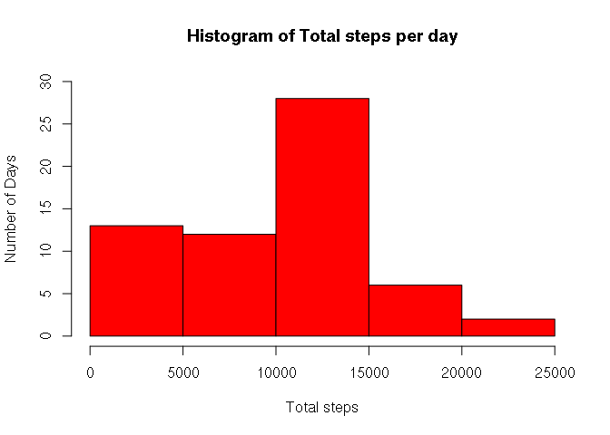
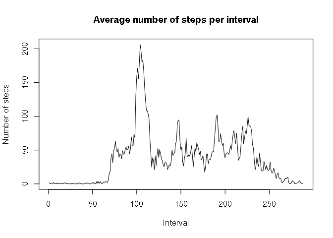
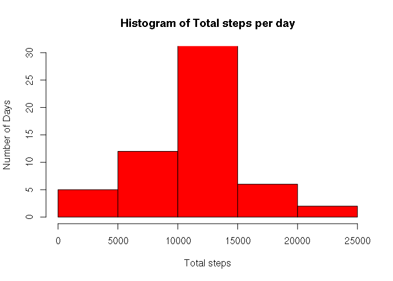
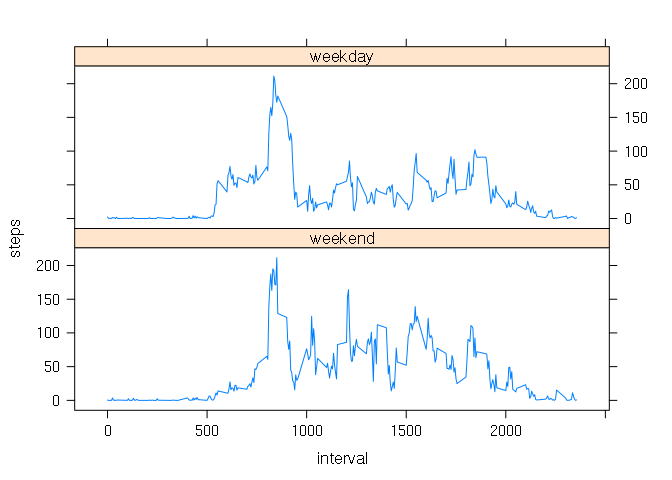

## Loading  and preprocessing the data


```r
## These libraries are used to process data...
library(plyr)
library(dplyr)
```

```
## 
## Attaching package: 'dplyr'
```

```
## The following objects are masked from 'package:plyr':
## 
##     arrange, count, desc, failwith, id, mutate, rename, summarise,
##     summarize
```

```
## The following objects are masked from 'package:stats':
## 
##     filter, lag
```

```
## The following objects are masked from 'package:base':
## 
##     intersect, setdiff, setequal, union
```

```r
#Now activities are in the activity.csv file:

activities<-read.csv("activity.csv")
```

## What is mean total number of steps taken per day?


```r
#First calculate the total number of steps taken per day

daily_activities<- activities %>%
    group_by(date)%>%
    summarise(steps=sum(steps,na.rm=TRUE))
#

#And display it in a histogram...

hist(daily_activities$steps, 
     ylab="Number of Days",
     xlab="Total steps",
     main="Histogram of Total steps per day",
     ylim=c(0,30),
     col="red")
```

<!-- -->

```r
#Now this is the mean of steps per day

mean(daily_activities$steps)
```

```
## [1] 9354.23
```


```r
#And this is the median...

median(daily_activities$steps)
```

```
## [1] 10395
```

## What is the average daily activity pattern?


```r
#Display a time series of the average daily pattern for each 5 minute interval

time_series<-activities %>%
  group_by(interval) %>%
  summarise(steps=mean(steps,na.rm=TRUE))

plot(seq(1,288),time_series$steps,type="l", main="Average number of steps per interval",xlab="Interval",ylab="Number of steps")
```

<!-- -->


```r
# On average the maximum number of steps occurs in the following interval

which.max(time_series$steps)
```

```
## [1] 104
```
## Imputing missing values


```r
# There are this number of missing values:
nas<-is.na(activities$steps)
sum(nas)
```

```
## [1] 2304
```

```r
# Filling missing values with mean of corresponding 5 minute interval

activities_notna<-activities
missing_intervals<-activities_notna[nas,]$interval
activities_notna[nas,]$steps<-round(time_series[match(missing_intervals,time_series$interval),]$steps)

#Calculate again the total number of steps taken per day
daily_activities<- activities_notna %>%
    group_by(date)%>%
    summarise(steps=sum(steps))

hist(daily_activities$steps, 
     ylab="Number of Days",
     xlab="Total steps",
     main="Histogram of Total steps per day",
     ylim=c(0,30),
     col="red")
```

<!-- -->

```r
#Now this is the new mean of steps per day

mean(daily_activities$steps)
```

```
## [1] 10765.64
```


```r
#And this is the new median...

median(daily_activities$steps)
```

```
## [1] 10762
```
## Are there differences in activity patterns between weekdays and weekends?

```r
#Add a factor to dataset, containing woorkday or weekend

activities_notna <-activities_notna %>%
  mutate(weekday=
           as.factor(weekdays(as.Date(activities_notna$date)))) %>%
  mutate(weekday=mapvalues(weekday,from=levels(weekday),to=c("weekend",rep("weekday",5),"weekend")))


#Let's calculate the average number of steps taken each 5 minute
#interval on weekdays and weekends

average_steps<-activities_notna%>%
    group_by(weekday,interval)%>%
    summarise(steps=mean(steps))

library(lattice)

xyplot(steps ~ interval|weekday, average_steps,type="l",layout=c(1,2))
```

<!-- -->


